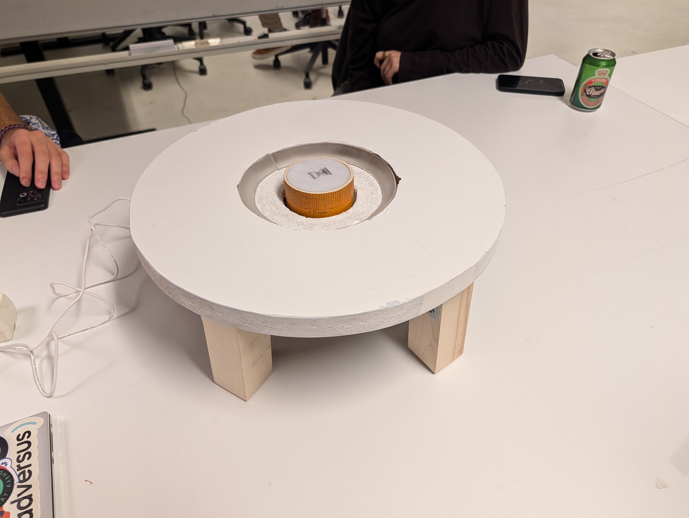

# Study timer - ambient light

Ths repo contains code for the the ambient light project for FitDes fall semester 2025 at Aarhus University.

The `./ambient-light` folder contains the main code for the project, controlling the dial, focus light and the contact switching for checking if the dial is pressed.

The `./ambient-light-servo` folder contains code for controlling the servo motor, that keep the dial in place when the dial is pressed down.
